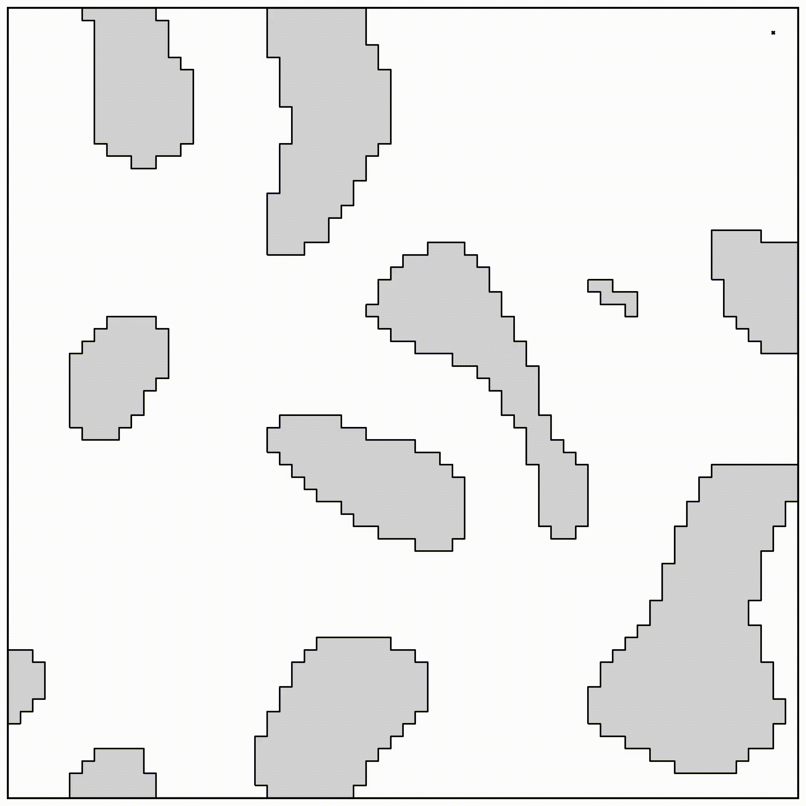
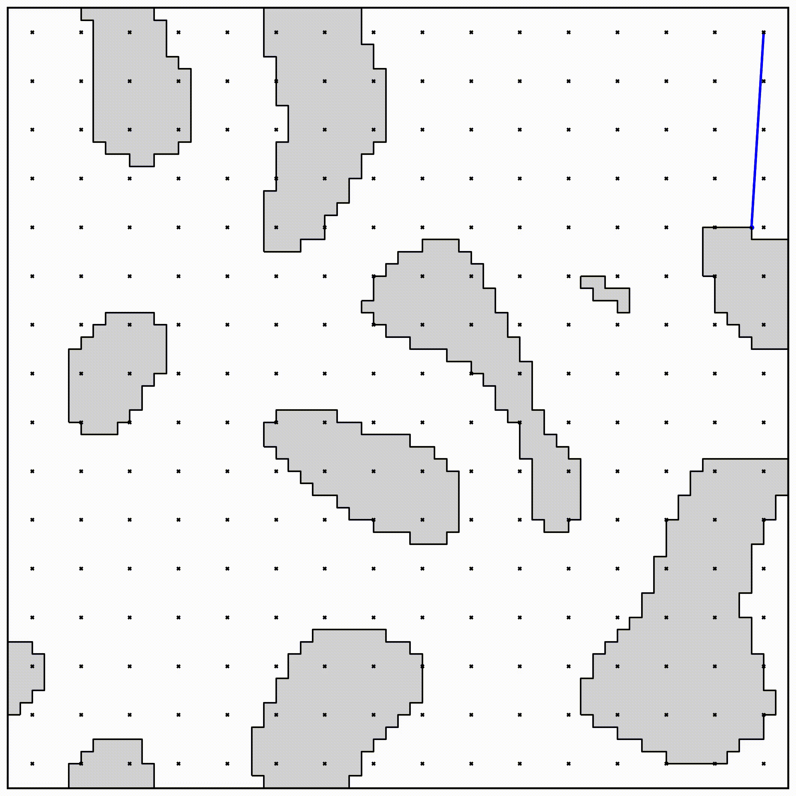
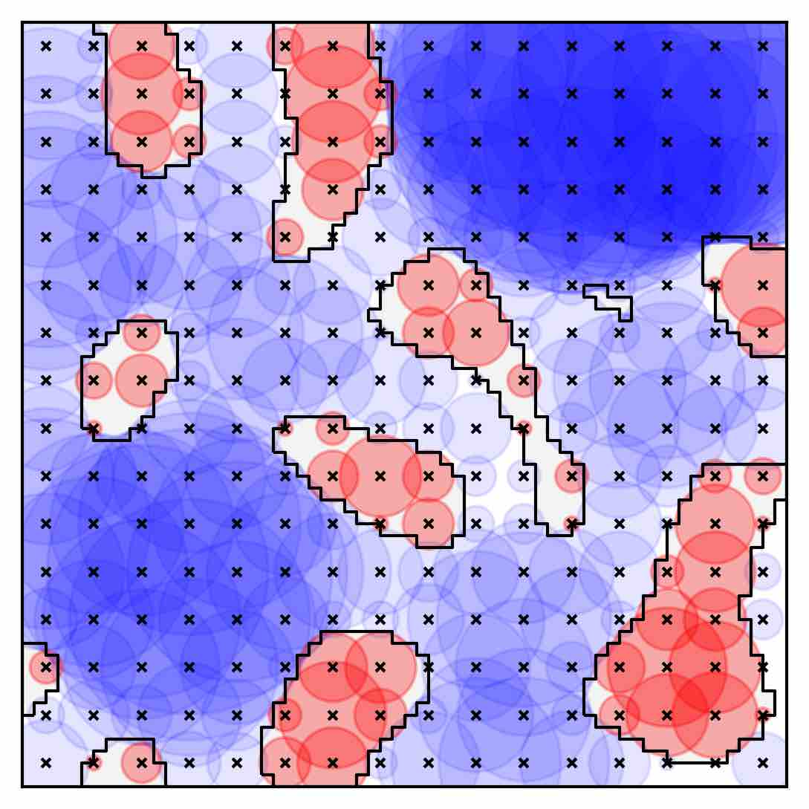
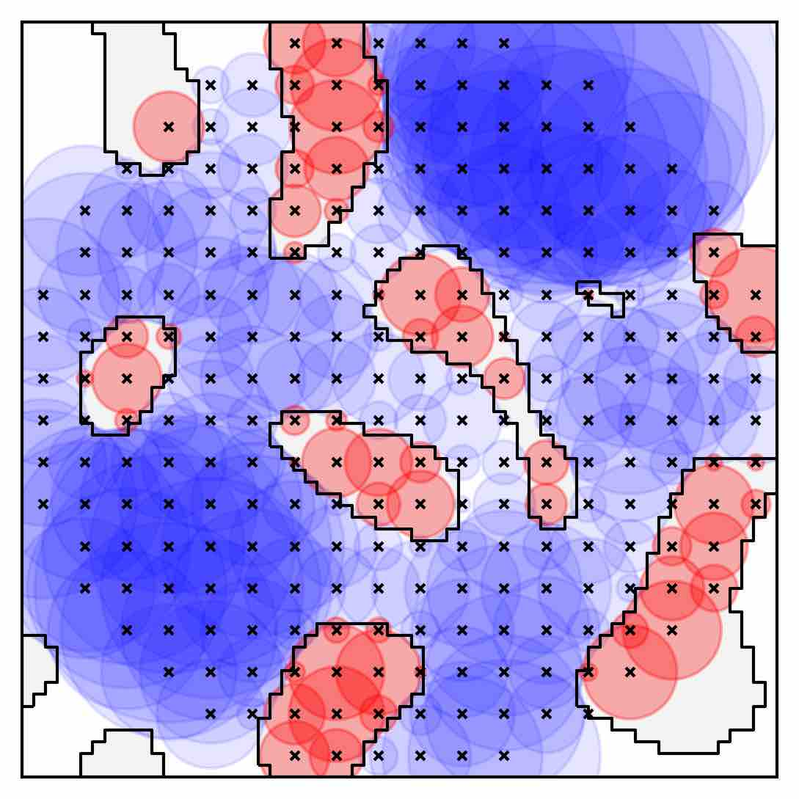
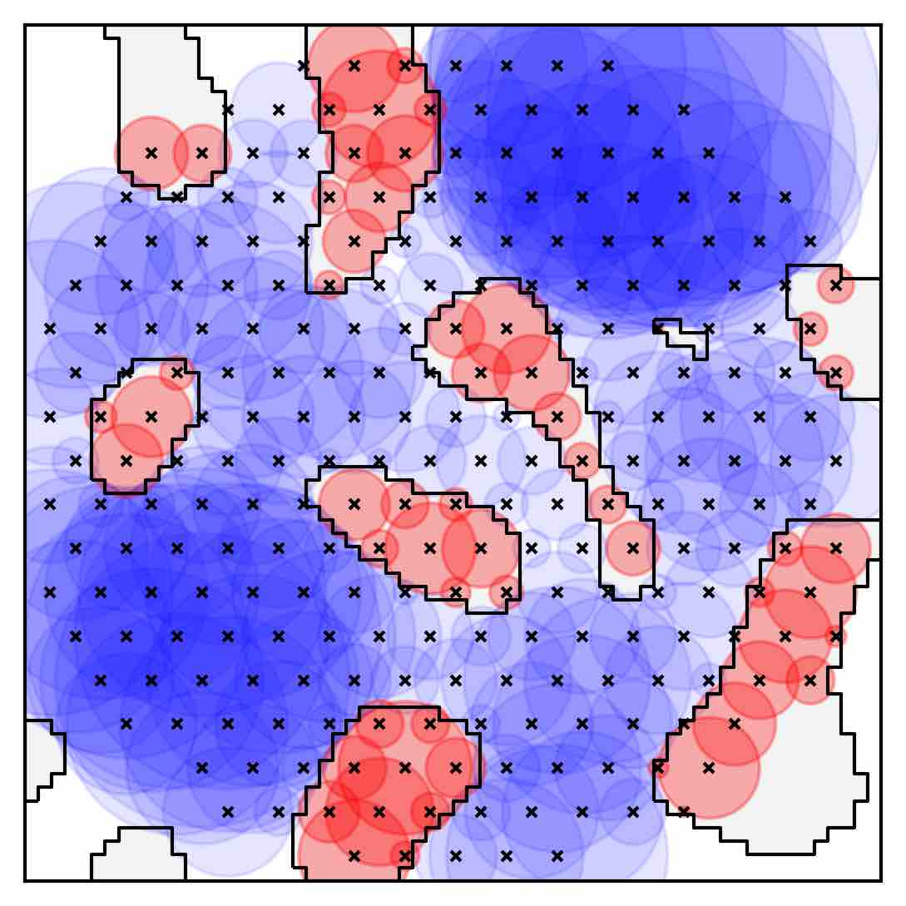
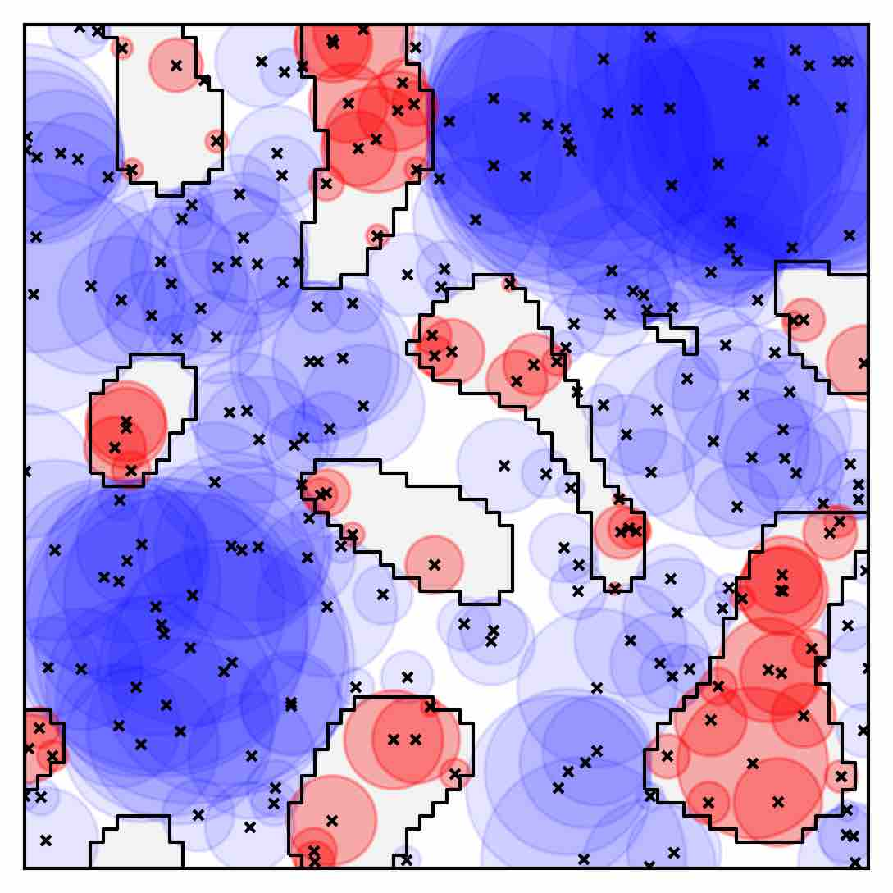
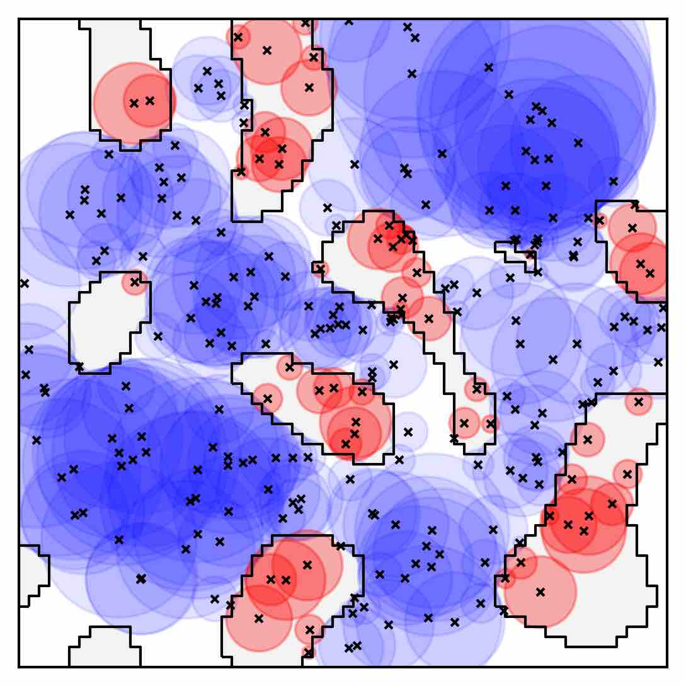
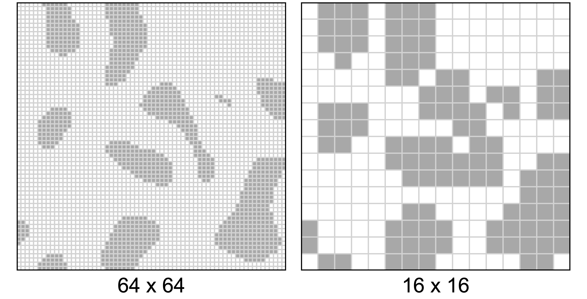
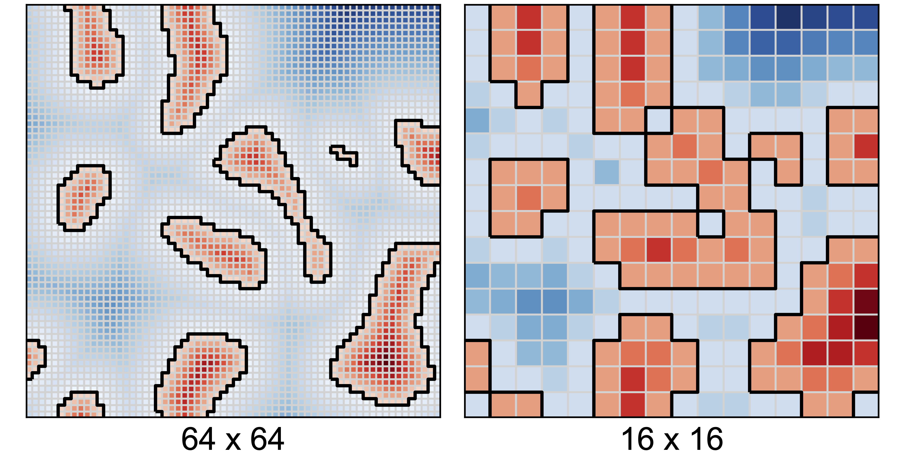
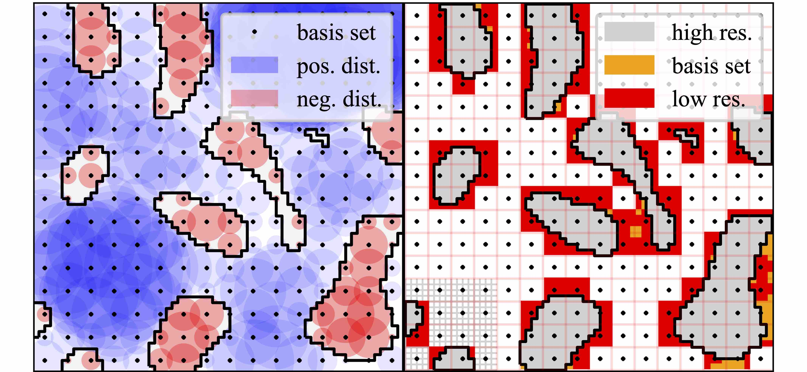

Here we discuss the basis point set [[Prokudin2019](https://arxiv.org/abs/1908.09186)] as an environment representation 
for motion planning.
It is a memory and computation efficient representation of spatial information.
But because until now, its application mainly was to computer graphics with a focus on visual results, we looked at the maximal error this encoding can make when using it as the basis for collision avoidance.
We compared it to other common representations and found that it is well suited to represent the binary environment in which the robots should move. 

---

The basis point set is strongly connected to a distance field. 
Each point in the set measures the distance to the closest obstacle in the environment. 
If the points lie on a regular grid this encoding is identical to a distance field.

|                                 Basis Points                                  |                                         Closest Obstacles                                         |                                          Conclusion to Area                                           |
|:-----------------------------------------------------------------------------:|:-------------------------------------------------------------------------------------------------:|:-----------------------------------------------------------------------------------------------------:|
| {:.this style="width: 400px"} | {:.this style="width: 400px"} | {:.this style="width: 400px"} | 

*Here you can see the closest obstacle for all basis points and the conclusion on can draw from this for the free (blue) and occupied space (red).*

---

There are different options to choose the basis points. 
The random set worked best for [[Prokudin2019](https://arxiv.org/abs/1908.09186)] but for our use case we prefer a more conservative choice.
For a regular grid or a hexagonal closed pack (HCP) grid one can estimate the maximal error better.

|        |                                   Box                                    |                                    Sphere                                    |
|:------:|:------------------------------------------------------------------------:|:----------------------------------------------------------------------------:|
|  Grid  | {:.this style="width: 500px"} | {:.this style="width: 500px"} | 
|  HCP   |   {:.this style="width: 500px"}   |   {:.this style="width: 500px"}   |
| Random | {:.this style="width: 500px"}  | {:.this style="width: 500px"}  | 

---

We use the basis point set to encode the environment and feed it to a neural network.
But, there are other choices.
The underlying ground truth from the data we generated is a 64x64 occupancy grid and the optimization-based motion planner uses the signed distance field to compute collision free paths.

**Occupancy Grid**
{:.this 
style="width: 750px; 
display: block;
margin-left: auto;
margin-right: auto"}

**Signed Distance Field**
{:.this 
style="width: 750px; 
display: block;
margin-left: auto;
margin-right: auto"}

**Accuracy of Basis Point Set compared to a down-sampled Occupancy Grid**
{:.this 
style="width: 750px; 
display: block;
margin-left: auto;
margin-right: auto"}

