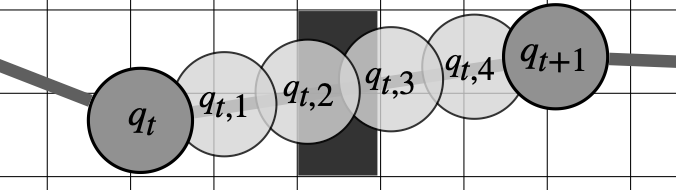

We used our own variant of [CHOMP](https://journals.sagepub.com/doi/10.1177/0278364913488805) as optimization-based solver to generate the dataset and post-process the predictions of the neural network.
The main difference is that we dynamically add sub steps to ensure no collisions are missed when discretizing the path

{:.this 
style="width: 600px; 
display: block;
margin-left: auto;
margin-right: auto"}
*Substeps between two discrete waypoints \\(q_t\\) and \\(q_{t+1}\\) to explicitly calculate the swept volume of the path and ensure no obstacles are missed.*

**Path**

$$
Q = [q_1, \dots, q_{\mathrm{t}}], \, q_t \in \mathbb{R}^{N_{\mathrm{q}}}
$$

**Objective Function**

$$
U(Q) = U_c(Q) + \alpha \, U_s(Q) + \beta \, U_l(Q)
$$

**Length Cost**

$$
U_l(Q) = \frac{N_{\mathrm{t}}-1}{|q_{N_{\mathrm{t}}}-q_1|^2} \sum_{t=1}^{N_{\mathrm{t}}-1} |q_{t+1} - q_{t}|^2
$$

**Collision Cost**

$$
U_c(Q) = \sum_{t, r}^{N_{\mathrm{t}}, N_{\mathrm{r}}} \sum_{i=1}^{N_{\mathrm{f}}} \sum_{k=1}^{N_{\mathrm{s}}} 
c \Big( 
    D \big( 
        F_i(q_{t, r}) \cdot{} x_{ik}
    \big) 
    - r_{ik}
\Big)
$$

**Smooth Clipping Function**

$$
\begin{aligned}
c(d) &= 
\left\{
\begin{array}{ll}
-d + \frac{\epsilon}{2}               & \text{, if }                d <    0 \\ 
\frac{1}{2 \epsilon} (d - \epsilon)^2 & \text{, if }  0        \leq d \leq \epsilon \\
0                                     & \text{, if }  \epsilon <    d
\end{array}
\right.
\end{aligned}
$$

**Self-collision Cost**

$$
U_s(Q) = \sum_{t, r}^{N_{\mathrm{t}}, N_{\mathrm{r}}} \, \sum_{j>i}^{N_{\mathrm{f}}, N_{\mathrm{f}}} \, \sum_{k, l}^{N_{\mathrm{s}i}, N_{\mathrm{s}j}} 
c \big( 
    \big| 
         F_{i}(q_{t, r}) \cdot x_{ik}  -  F_{j}(q_{t, r}) \cdot x_{jl} 
    \big|
    - r_{ik} - r_{jl} 
\big)
$$
