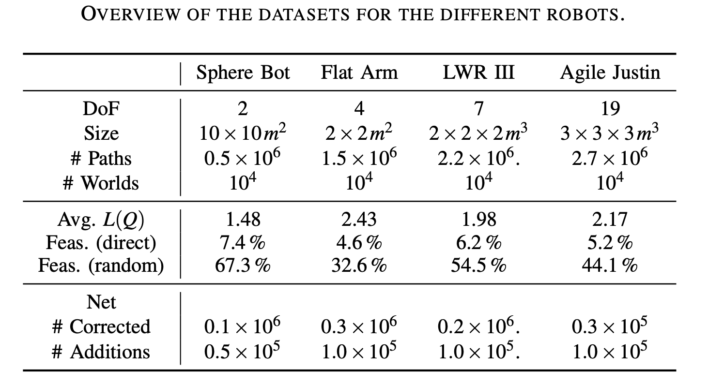

Click the links to download the dataset for a robot.
Each SQL database consists of two tables: 'worlds' and 'paths'.
The start and end of a path together with the world decribe the motion task
and the full path is the correspoinding solution, which is also used as label in the training. 

* [SingleSphere02](../dataset/SingleSphere02.csv.zip)
* [StaticArm04](../dataset/StaticArm04.csv.zip)
* [JustinArm07](../dataset/JustinArm07.csv.zip)
* [Justin19](../dataset/Justin19.csv.zip)
---

---
