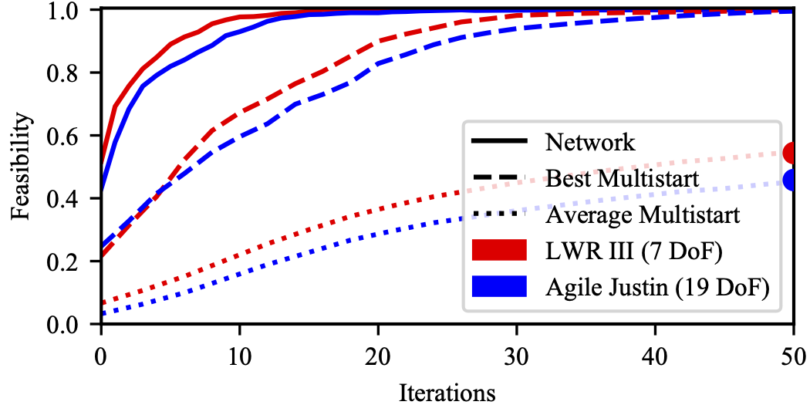

---

Top: Average convergence to feasibility of OMP for different initial guesses. 
The prediction of the network outperforms the average and even the best out of 100 multi-starts significantly.
Bottom: Distribution of the average feasibility of the random multi-starts after 50 OMP iterations.

---