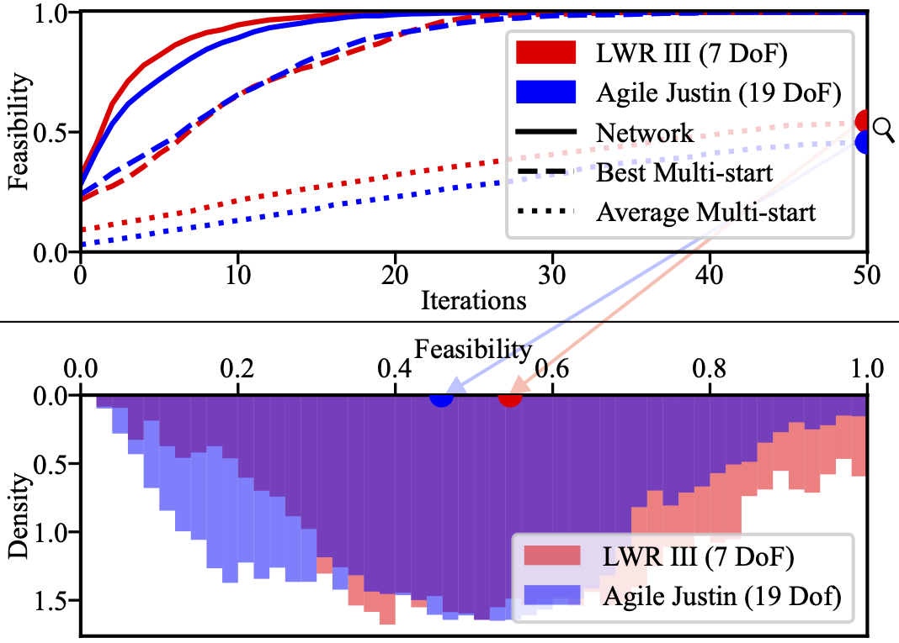

---

Average convergence to feasibility for different initial guesses for the LWR III and Agile Justin over 10000 tasks in 1000 unseen worlds. The prediction of the network outperforms even the best out of 100 multi-starts significantly.

---

Distribution of the average feasibility of multi-starts after 50 iterations over 10000 different motion tasks in 1000 unseen worlds.

---
