We looked at four different robots to test our method.
Two toy robots in 2D and two real robots in 3D. 

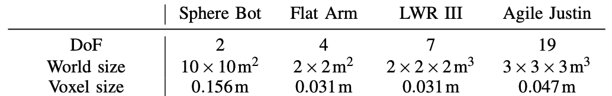{:.this 
style="width: 600px; 
display: block;
margin-left: auto;
margin-right: auto"}

---
# Sphere Bot

|:--------------------------------------------------------------------------------------:|:---------------------------------------------------------------------------------------------------:|
| {:.this style="width: 500px"} | 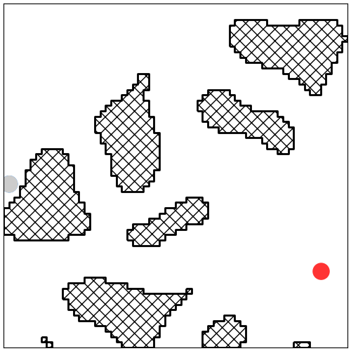{:.this style="width: 485px"} |

A single sphere moving in the plane.
Its two "prismatic joints" move it directly along the x and y-axis, which means that configuration space and workspace are identical for this robot.
Therefore, a network does not need to learn any forward kinematics for this robot and the example is excellent for understanding the cartesian workspace.
The sphere's radius is 0.25m, and it moves in a 10m x 10m world.
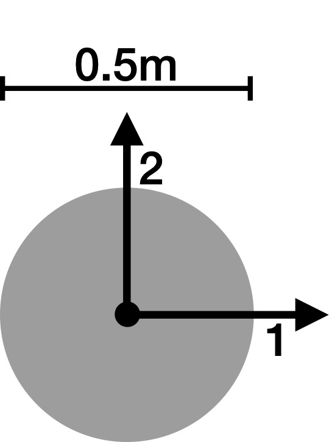{:.this 
style="width: 100px; 
display: block;
margin-left: auto;
margin-right: auto"}

---
# Flat Arm

|:--------------------------------------------------------------------------------------:|:---------------------------------------------------------------------------------------------------:|
| 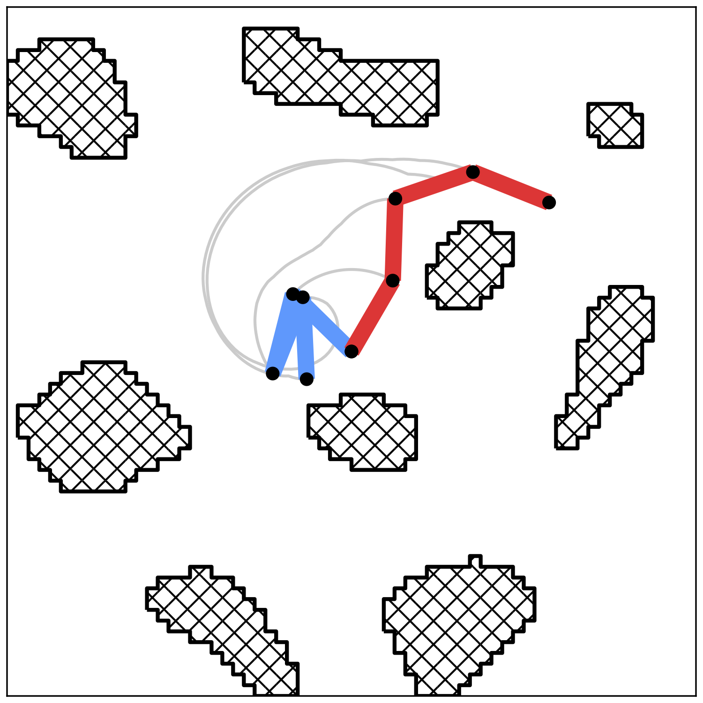{:.this style="width: 500px"} | 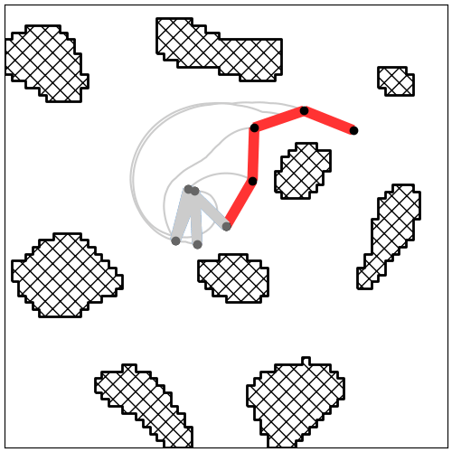{:.this style="width: 500px"} |

A serial arm in the plane with 4 revolute joints.
Because it is still in 2D with only a few degrees of freedom, one can easily visualize what is going on. 
Also, the training time is relatively short and allows for quick iterations while including already the full complexity of robotic path planning.
Furthermore, the motion tasks for the arm in the cluttered 2D world are pretty complex and even get in a sense easier in 3D, as there is an additional dimension for collisions avoidance. 
Each link is 0.25m long, adding up to a total reach of 1m.
The joint limits go from [-170, +170] degrees.
Its base is fixed in a 1.1m x 1.1m world.
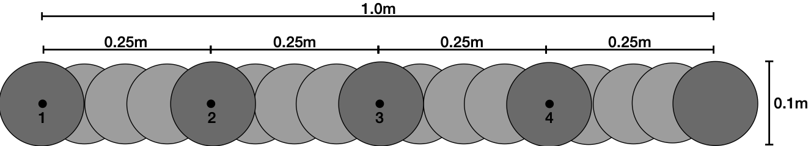{:.this 
style="width: 700px; 
display: block;
margin-left: auto;
margin-right: auto"}

---
# LWR III

|:--------------------------------------------------------------------------------------:|:---------------------------------------------------------------------------------------------------:|
| 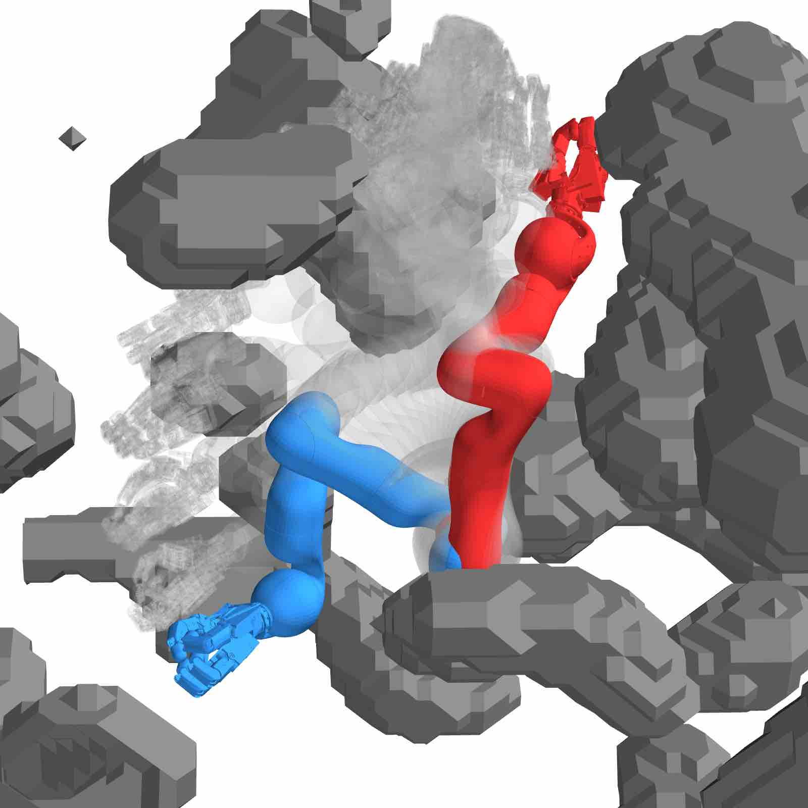{:.this style="width: 500px"} | 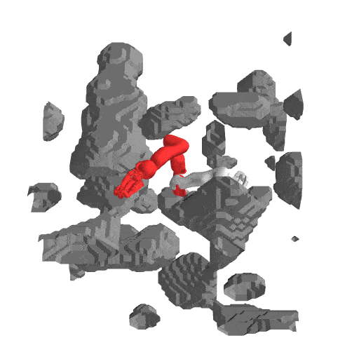{:.this style="width: 500px"} |

A serial arm with 7 joints in 3D.
This is not only a classic example for a robotic arm but also a building block for the humanoid robot Agile Justin.
Without a hand, the reach of the arm is 0.95m.
It is centered in a 1.4m x 1.4m x 1.4m world.
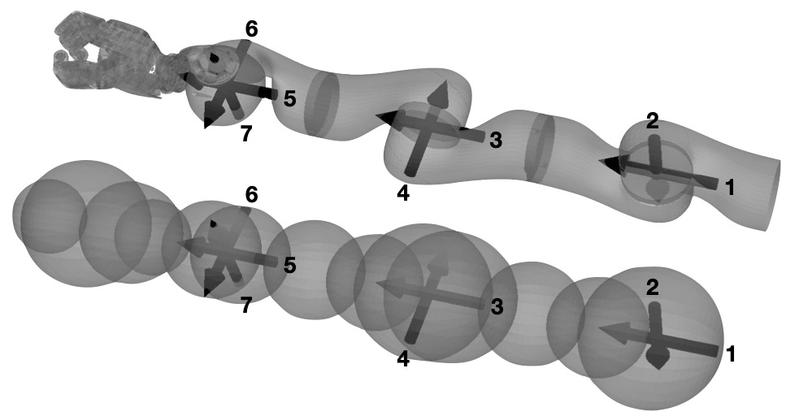{:.this 
style="width: 500px; 
display: block;
margin-left: auto;
margin-right: auto"}

---
# Agile Justin

|:--------------------------------------------------------------------------------------:|:---------------------------------------------------------------------------------------------------:|
| 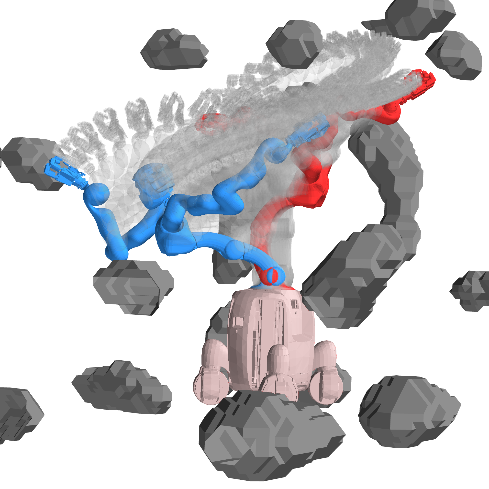{:.this style="width: 500px"} | {:.this style="width: 500px"} |

A humanoid robot with 19 DoF.
The joints are distributed over two arms (LWR III) with 7 joints each, an upper body with 3 joints (+ one passive joint)
and the head with 2 joints.
This more complex kinematic structure which branches into a head and two arms poses additional challenges.
As a consequence, self-collision also becomes more probable.
The robot can fully extend up to 2.8m in the air and 1.8m to the sides.
It is centered in a cube 3.5m x 3.5m x 3.5m.
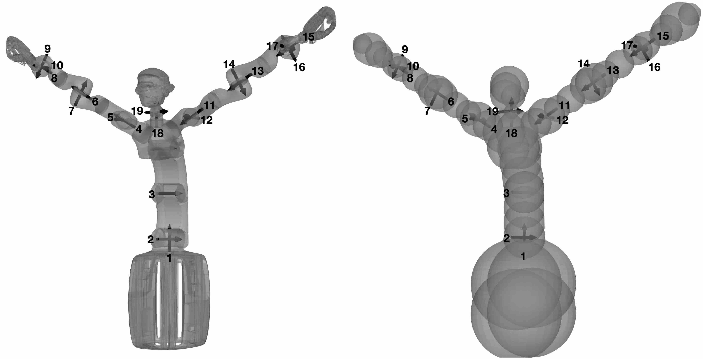{:.this 
style="width: 800px; 
display: block;
margin-left: auto;
margin-right: auto"}
