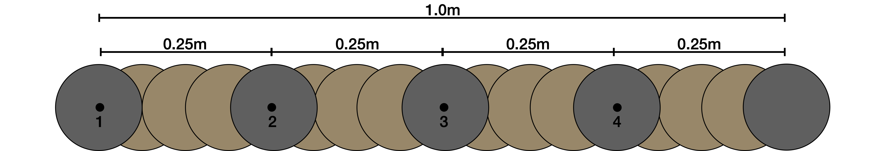
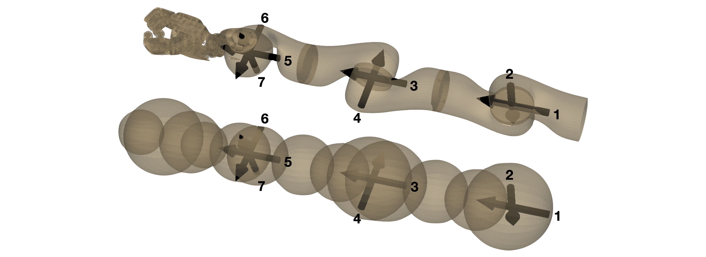
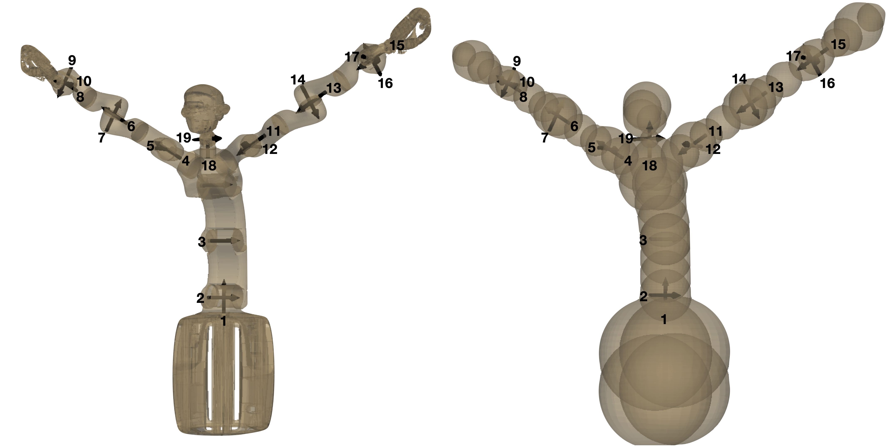

We looked at four different robots to test our method.
Two toy robots in 2D and two real robots in 3D. 

---
# SingleSphere02
A single sphere moving in the plane.
It's two "prismatic joints" move it directly along the x and y-axis, which means that for this robot configuration space and workspace are identical.
Therefore a network does not need to learn any forward kinematics for this robot and the example is great for understanding the cartesian workspace.
The radius of the sphere is 0.25m and it moves in a 10m x 10m world.

---
# StaticArm04
A serial arm in the plane with 4 revolute joints.
Because it is still in 2D with only a few degrees of freedom, one can easily visualize what is going one. 
Also the training time is relatively small and allows for quick iterations while including already the full complexity of robotic path planning.
Furthermore the motion tasks for the arm in the cluttered 2D world are quite hard and even get in a sense easier in 3D, as there is an additional dimension for collisions avoidance. 
Each link is 0.25m long, adding up to a total reach of 1m.
The joint limits go from [-170, +170] degree.
Its base is fixed in a 1.1m x 1.1 m world

---
# LWR III
A serial arm with 7 joints in 3D.
This is not only a classical example for a robotic arm but also a building block for the humanoid robot Agile Justin.
Without a hand the reach of the arm is 0.95m.
It is centered in a 1.4m x 1.4m x 1.4m world

---
# Agile Justin
A humanoid robot with 19 DoF.
The joints are distributed over two arms (LWR III) with 7 joints each, an upper body with 3 joints (+ one passive joint)
and the head with 2 joints.
This more complex kinematic structure which branches into a head and two arms poses additional challenges.
As a consequence, self collision becomes also more probable.
Fully extended the robot can reach up to 2.8m in the air and 1.8m to the sides.
It is centered in a cube 3.5m x 3.5m x 3.5m.

