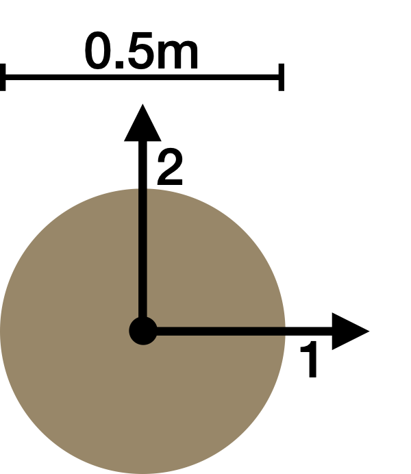
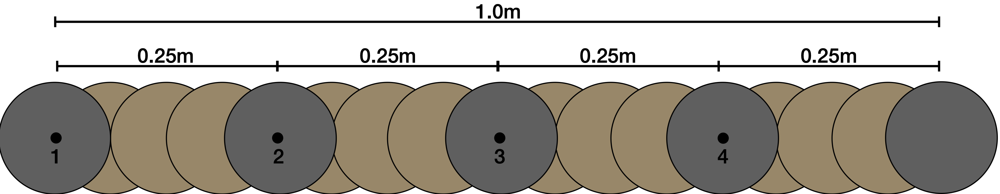
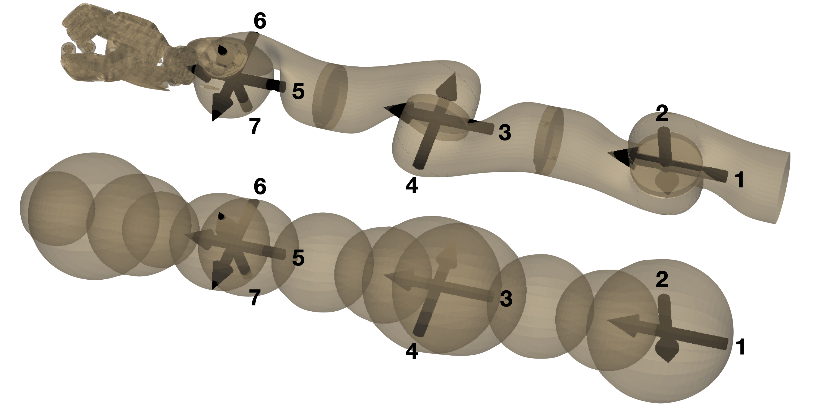
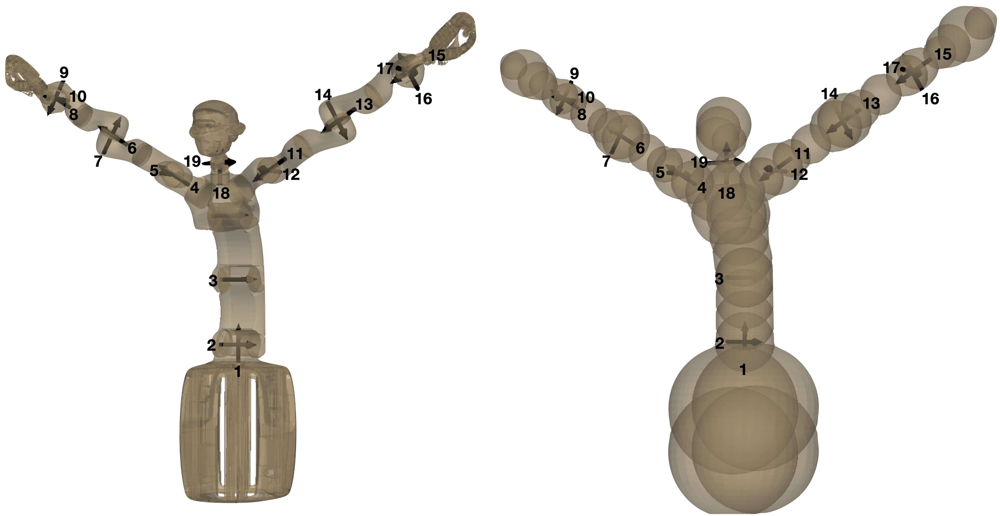

We looked at four different robots to test our method.
Two toy robots in 2D and two real robots in 3D. 

---
# SingleSphere02
A single sphere moving in the plane.
It's two "prismatic joints" move it directly along the x and y-axis, which means that configuration space and workspace are identical.
The radius of the sphere is 0.25m and it moves in a 10m x 10m world.

---
# StaticArm04
A serial arm in the plane with 4 revolute joints.
Each link is 0.25m long, adding up to a total reach of 1m.
The joint limits go from [-170, +170] degree.
Its base is fixed in a 1.1m x 1.1 m world

---
# LWR III
A serial arm with 7 joints.
Without a hand the reach of the arm is 0.95m.
It is centered in a 1.4m x 1.4m x 1.4m world

---
# Agile Justin
A humanoid robot with 19 DoF.
The joints are distributed over two arms (LWR III) with 7 joints each, an upper body with 3 joints (+ one passive joint)
and the head with 2 joints.
Fully extended the robot can reach up to 2.8m in the air and 2.XXXm to the sides.
It is centered in 1 3.5m x 3.5m x 3.5m.

