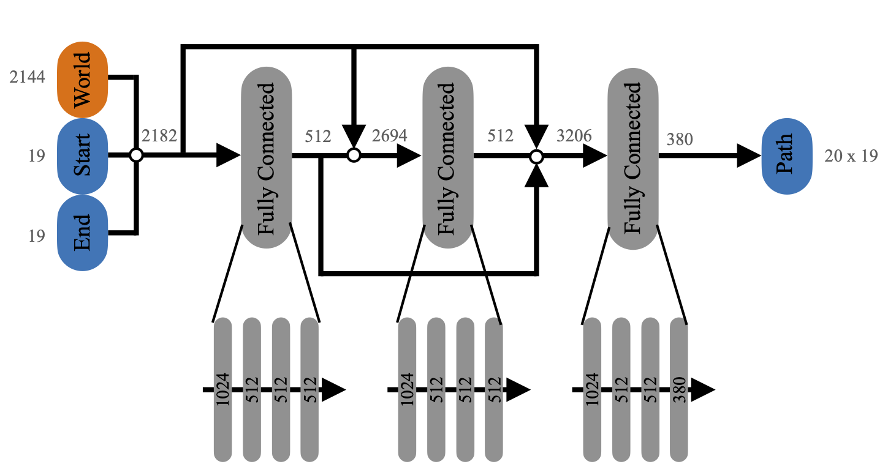

We train the networks supervised and used the MSE as loss.

---

This is the general flow of information through the network.
The network architecture consists only of fully connected layers and skip connections.

---
In the next section we provide the detailed number weights for each robot.
In 2D we used a set size of 256 for the fixed basis, in 3D we used 2144.
Furhtermore we scaled the networks roughly with the degrees of freedom of the corresponding robot. 

# Agile Justin

# SingleSphere02

# StaticArm04

# LWR III 

