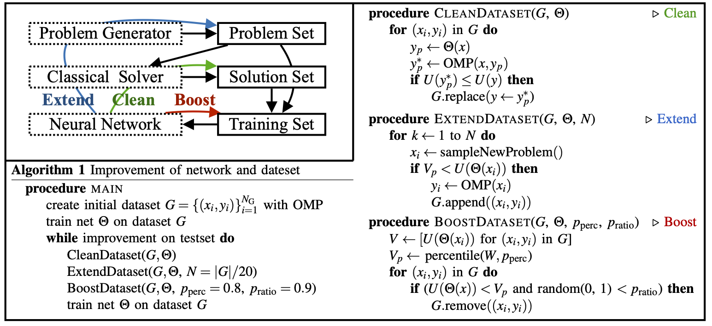
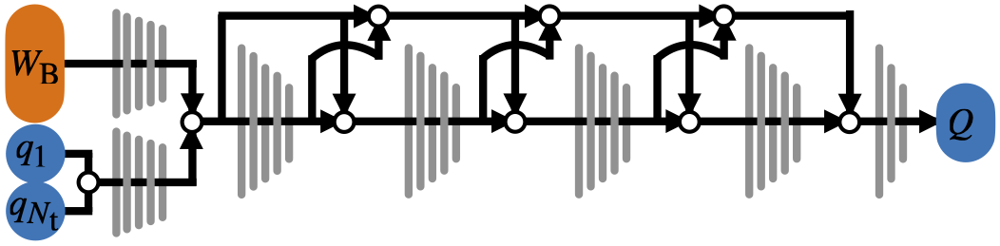

We want to improve an existing method (OMP) by replacing some parts with a neural network (Initial guess).
This setup allows some tricks.
Especially the objective function, which the optimizer tries to minimize, plays a central role, as it makes it possible to compare different suggestions for a given motion problem objectively.

This means that the dataset does not have to be static after it was generated with the classical setup.
One can periodically check if the prediction of the network is better than the corresponding label. 
If the objective function of the prediction is lower, then this path is better and can replace the current label without adding any bias to the dataset.
Of course, for this to work, the dataset must have a certain quality, and the network must have already learned enough to make valuable predictions.
But we found that even in an early stage of training, the difference between network prediction and label is a good indicator of where to invest resources to improve the dataset.
One can continue this idea one step further and use the objective function to decide which samples have valuable information for the network and adjust the curriculum accordingly or produce new challenging samples.  

{:.this 
style="width: 800px; 
display: block;
margin-left: auto;
margin-right: auto"}
*Scheme showing the connection between the classical solver, dataset and neural network.
The colored arrows indicate the information flow for cleaning, extending and boosting the dataset with guidance of the network.*

---
# Neural Network
We trained the networks supervised and used the MSE loss between the correct label and the predicted path.
{:.this 
style="width: 800px; 
display: block;
margin-left: auto;
margin-right: auto"}
*This is the general flow of information through the network.
The network architecture consists only of fully connected layers and skip connections.*

---

Here are the settings we used to train the neural network fot Agile Justin.

|   Parameter   | Value |
|:-------------:|:-----:|
|   Optimizer   | Adam  |
| Learning Rate | 1e-4  |
|  Batch Size   |  256  |
|    Epochs     |  500  |
| Training Time |  17h  |

*TODO add missing data to table!*
