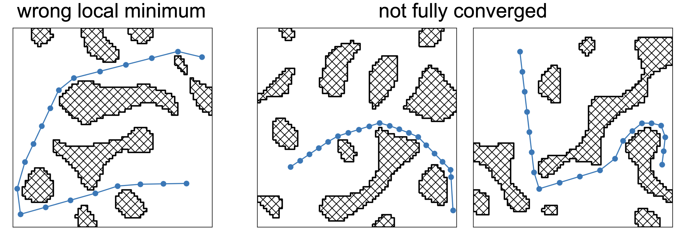

# Network based Iterative Dataset Generation
---

This setup, where we want to improve an existing method by replacing some parts with a neural network, allows some tricks.
Especially the objective function, which the optimizer tries to minimize, plays a central role, as it makes it possible to compare different suggestions for a given motion problem objectively.

This means that the dataset does not have to be static after its generated with the classical setup.
One can regularly check if the prediction of the network is better than the corresponding label. 
If the objective function of the prediction is lower, then this path is better and can replace the current label without adding any bias to the dataset.
Of course, for this to work, the dataset must have a certain quality, and the network must have already learned enough to make valuable predictions.
But we found that even in an early stage of training, the difference between network prediction and label is a good indicator of where to invest resources to improve the dataset.

One can continue this idea one step further and use the objective function to decide which samples have valuable information for the network and adjust the curriculum accordingly or produce new challenging samples.  

---
Those examples show the problem with inconsistent labels.
While more compuatational resources can solve those problems it is more efficient to use the help of the network as guidance.
Using the prediction of the network as indicator is also more general, then applying some custom heuristics to identify potential outliers.

---
* TODO add ablation study show necessity for each of those steps

We train the networks supervised and used the MSE as loss.

---

This is the general flow of information through the network.
The network architecture consists only of fully connected layers and skip connections.

---
In the next section we provide the detailed number weights for each robot.
In 2D we used a set size of 256 for the fixed basis, in 3D we used 2144.
Furthermore, we scaled the networks roughly with the degrees of freedom of the corresponding robot. 

