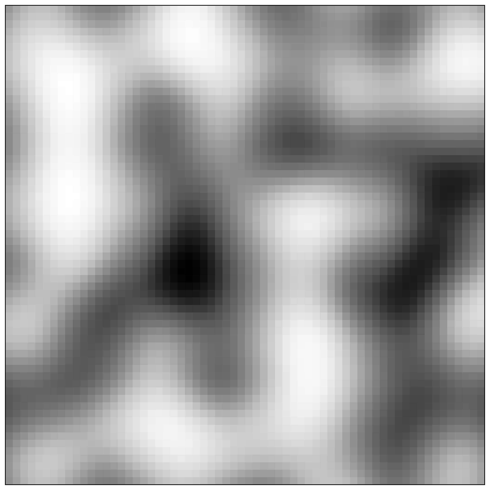
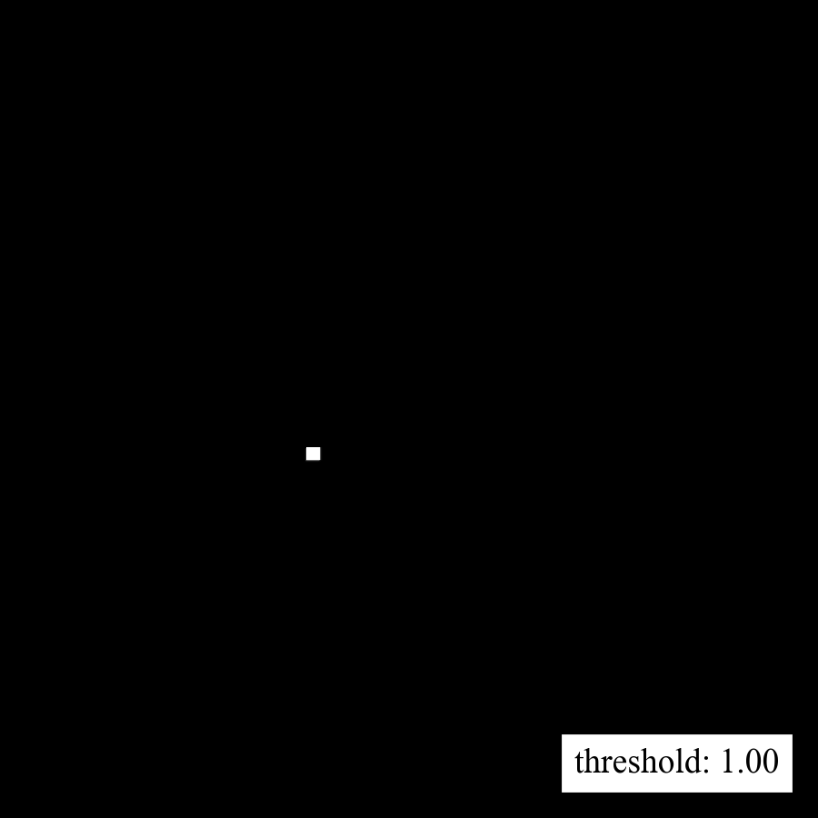
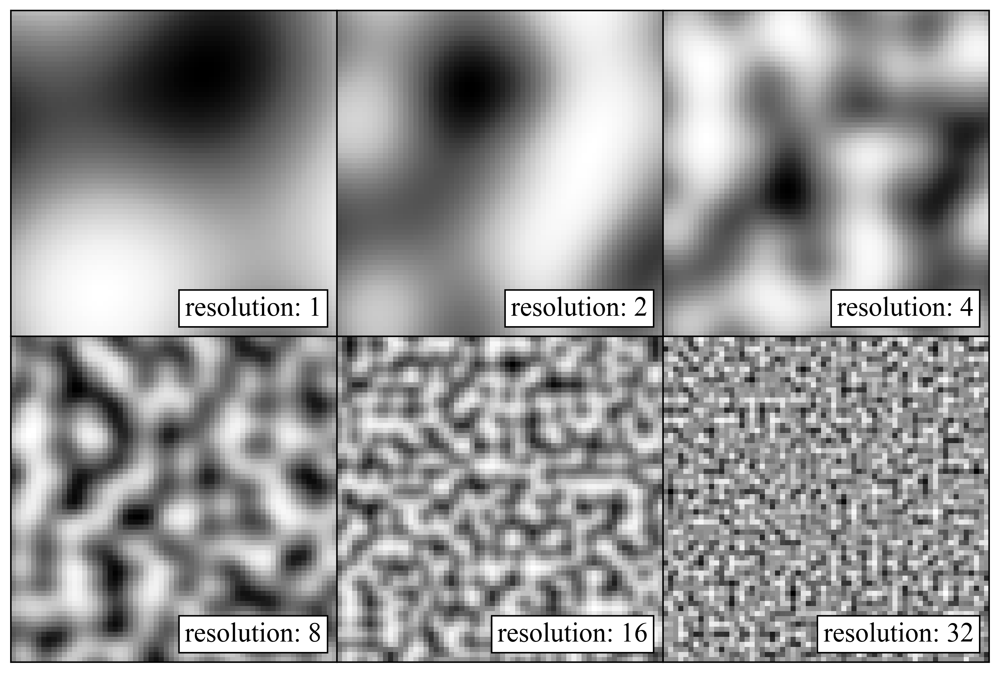
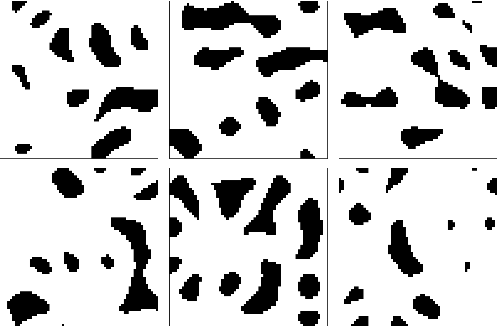

We used [Simplex Noise](https://en.wikipedia.org/wiki/Simplex_noise) to generate a wide variety of challenging worlds for our robots.
Like its predecessor Perlin noise, Simplex noise is a gradient noise used as a procedural texture to increase the realism in computer graphics.
It is, for example, used in computer games to produce always new worlds.

In our case, we used a 64x64 binary occupancy grid for the environments of our robots.
Agile Justin uses to the same representation to map the world [Wagner2013](http://www.informatik.uni-bremen.de/agebv2/downloads/published/wagner_icra_13.pdf), and finally we want to apply our methods on this humanoid robot.
To get from a continuous noise to a binary occupancy grid, we applied a threshold.

---

|                                                           Noise Field                                                            |                                                    Occupancy Grid                                                     |
|:--------------------------------------------------------------------------------------------------------------------------------:|:---------------------------------------------------------------------------------------------------------------------:|
|                      {:.this style="width: 500px"}                       |          {:.this style="width: 490px"}           |
 | *A continuous noise field, where each pixel has a value between 0 and 1. It can also be interpreted as a normalized height map.* | *This animation shows the influence of the threshold on the occupancy map, from a free plane to completely occupied.* | 

{:.this 
style="width: 750px; 
display: block;
margin-left: auto;
margin-right: auto"}
*Changing the resolution changes the frequency of the noise. 
To create variety on different resolution levels (elevation: continents/mountain range/hill), one can overlay different noise scales.*

---
**2D Examples**
{:.this 
style="width: 750px; 
display: block;
margin-left: auto;
margin-right: auto"}
*Examples of 2D worlds all with the same noise resolution and threshold, to see the diversity 
of one single configuration.*

---

**3D Examples**
{:.this 
style="width: 750px; 
display: block;
margin-left: auto;
margin-right: auto"}
*The same procedure can be applied in 3D, and we use it to generate the asteroid field for our robots.*
